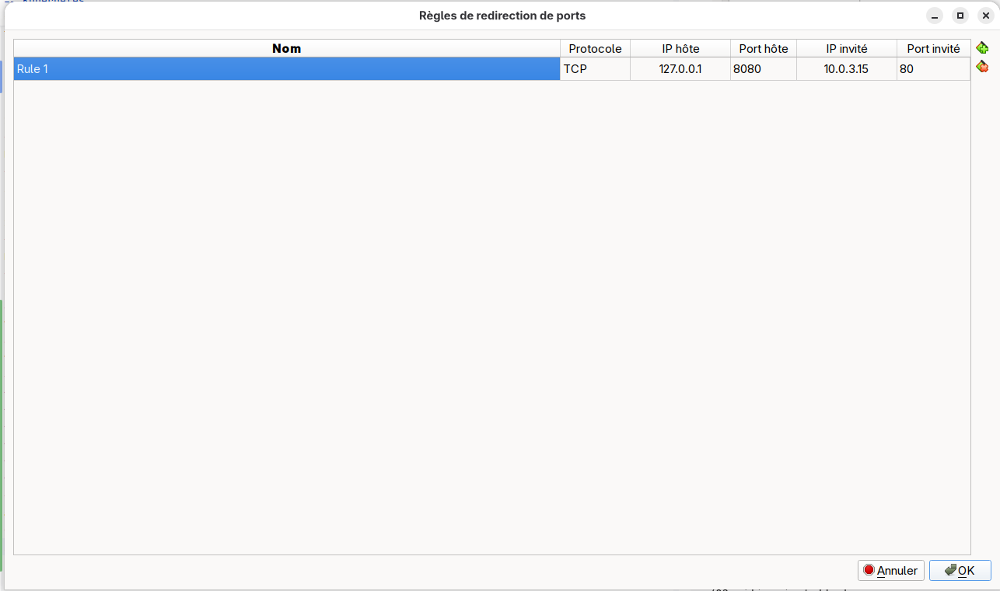

= Kubernetes scafolder

== Kubernetes

https://www.youtube.com/watch?v=-uqXhRC5uMs

https://sofianedjerbi.com/fr/blog/kubernetes-helm-complexity-myth/

prerequisites

Connection
[source,shell]
----
ssh damien@192.168.59.115
----

git installation
[source,shell]
----
sudo dnf install git -y
----

clone repository
[source,shell]
----
git clone https://github.com/dcdh/kubernetes-scafolder.git -v
----

Other commands must be done from **kubernetes-scafolder** repository.

Installation from VM:
[source,shell]
----
./01_kube_install.sh
----

=== Networks

The VM will have two actives networks.

INFO: **ERRATUM** The order of networks definition is not important. Cilium will always choose the interface which can access to internet (NAT interface in our case).

1. bridge network
+
Define a bridge network to allow host to VM communication.
+
image::01_network_adapter_1.png[]

2. nat network
+
Define a nat network to allow VM to internet communication.
+
image::02_network_adapter_2.png[]
+
The nat network is not accessible from the host.
+
To make it accessible, a port forward must be defined with
+
* **Name**: What you want
* **Protocol**: TCP
* **Host IP**: 127.0.0.1
* **Host PORT**: 8080
* **Guest IP**: 10.0...
* **Guest Port**: 80
+
and so, the hello world service will be available on port **8080** from the guest.
+

=== Cilium

Installation from VM:
[source,shell]
----
./02_cilium_install.sh
----

Cilium is used for CNI and LoadBalancer configuration

https://docs.cilium.io/en/latest/network/node-ipam/

When running without load balancer the External IP must be bound to the host network.

Multiple prerequisites:

* Cilium installation must have the variable **nodeIPAM.enabled** set to true (https://github.com/cilium/cilium/issues/38793)
* The label **localhost.localdomain node.kubernetes.io/exclude-from-external-load-balancers** must be removed from the node
* The service must be of type **LoadBalancer**
* The service must have the **loadBalancerClass** set to **io.cilium/node**
* The order of interfaces is very important. Cilium will match only the first one found. The first one must be the one accessible via the host so the IP must begin with **192.168.**

=== Hello Sample

Installation from VM:
[source,shell]
----
./03_hello_app_install.sh
----

Host configuration using the VM **127.0.0.1** IP from HOST
[source,shell]
----
echo "127.0.0.1 hello.local-lab.com" | sudo tee -a /etc/hosts
----

Execution from HOST
[source,shell]
----
curl http://hello.local-lab.com:8080
----

=== Postgresql

https://cloudnative-pg.io/

https://cloudnative-pg.io/documentation/1.27/installation_upgrade/

https://github.com/cloudnative-pg/charts

list of options to use
https://github.com/cloudnative-pg/charts/blob/main/charts/cluster/README.md

=== Persistent block storage

https://longhorn.io/docs/1.10.1/deploy/install/install-with-helm/

https://longhorn.io/docs/1.10.1/nodes-and-volumes/volumes/create-volumes/

Must install a blocks storage first

list storage classes
[source,shell]
----
kubectl get storageclasses.storage.k8s.io
----

get storage class output
[source,shell]
----
kubectl get storageclasses.storage.k8s.io longhorn-static -o yaml
----

Sample https://raw.githubusercontent.com/longhorn/longhorn/v1.10.1/examples/storageclass.yaml

=== Observability

==== Grafana

https://grafana.com/docs/grafana-cloud/monitor-infrastructure/kubernetes-monitoring/configuration/helm-chart-config/helm-chart/?pg=solutions-kubernetes-monitor&plcmt=easy-deployment#overview-of-grafana-kubernetes-monitoring-helm-chart

https://github.com/grafana/k8s-monitoring-helm/tree/main/charts/k8s-monitoring#setup-grafana-chart-repository

https://grafana.com/docs/grafana-cloud/monitor-infrastructure/kubernetes-monitoring/configuration/helm-chart-config/helm-chart/?pg=solutions-kubernetes-monitor&plcmt=easy-deployment#uninstall

https://grafana.com/docs/loki/latest/setup/install/helm/install-monolithic/

https://grafana.com/docs/loki/latest/setup/install/helm/monitor-and-alert/with-local-monitoring/

https://github.com/grafana/loki/blob/main/production/helm/loki/templates/single-binary/statefulset.yaml

https://grafana.com/grafana/dashboards/22705-longhorn-dashboard/

Uninstall
[source,shell]
----
kubectl delete alloy --all --namespace monitoring
helm uninstall --namespace monitoring grafana-k8s-monitoring
----

https://quarkus.io/guides/observability-devservices-lgtm

1. L → Loki (logs)
+
TODO

2. G → Grafana (metrics visualization)
+
TODO

3. T → Tempo (traces)
+
TODO

4. M → Mimir (long term storage for Prometheus)
+
TODO

=== Useful commands

List versions of charts
[source,shell]
----
helm search repo grafana --versions | grep meta-monitoring | more
----

List all resources (except crd)
[source,shell]
----
kubectl get all -A
----

Uninstall cilium
[source,shell]
----
helm uninstall cilium -n kube-system
kubectl delete crd $(kubectl get crd | grep cilium | awk '{print $1}')
----

Get all cilium
[source,shell]
----
helm get all cilium -n kube-system
----

Get cilium installation info
[source,shell]
----
helm get values -a -o yaml cilium -n kube-system
----

Get cilium installation info regarding nodeIPAM
[source,shell]
----
helm get values -a -o yaml cilium -n kube-system | grep nodeIPAM -A 3
----

list labels on nodes
[source,shell]
----
kubectl get nodes --show-labels
----

remove label on node
[source,shell]
----
kubectl label node localhost.localdomain node.kubernetes.io/exclude-from-external-load-balancers-
----

inspect gateway
[source,shell]
----
kubectl get gateway hello-gateway -n hello -o yaml | grep -A5 allowedRoutes
----

get httproute
[source,shell]
----
kubectl get httproute -A -o wide
----

get httproute
[source,shell]
----
kubectl get httproute hello-route -n hello -o yaml
----

=== GATEWAY ISSUE

If I've got a Hello deployment defining this kind of Gateway:

[source,yaml]
----
apiVersion: gateway.networking.k8s.io/v1beta1
kind: Gateway
metadata:
  name: hello-gateway
spec:
  gatewayClassName: cilium
  listeners:
    - name: http
      protocol: HTTP
      port: 80
      allowedRoutes:
        namespaces:
          from: Same
----

If I decide to deploy multiple instances on multiples namespaces likes **hello** accessible via **hello.local-lab.com** and **hello2** accessible via **hello2.local-lab.com**,
the first deployment will win and the second will not be available. Calling **http://hello.local-lab.com:8080** or **http://hello2.local-lab.com:8080** will call the first pod deployed each time

Checking the logs this way **kubectl logs pods/cilium-c6kft -n kube-system**

[source]
----
time=2025-11-19T20:54:27.754261304Z level=warn msg="Failure processing services" module=agent.controlplane.loadbalancer-reflectors.k8s-reflector error="frontend already owned by another service: 10.0.3.15:80/TCP is owned by hello/hello-service"
time=2025-11-19T20:54:30.998768658Z level=info msg="Triggering full policy recalculation and regeneration of all endpoints" module=agent.controlplane.policy reason="Envoy Listeners changed"
time=2025-11-19T20:54:31.172857259Z level=info msg="Auto-detected local ports to reserve in the container namespace for transparent DNS proxy" module=agent.controlplane.cilium-restapi.config-modification ports="[51871 8472]"
time=2025-11-19T20:54:31.174256419Z level=info msg="Auto-detected local ports to reserve in the container namespace for transparent DNS proxy" module=agent.controlplane.cilium-restapi.config-modification ports="[51871 8472]"
time=2025-11-19T20:54:31.190346989Z level=info msg="Create endpoint request" module=agent.controlplane.endpoint-api addressing="&{IPV4:10.0.0.57 IPV4ExpirationUUID:c9622729-0b2a-4c33-985d-5e930f488291 IPV4PoolName:default IPV6: IPV6ExpirationUUID: IPV6PoolName:}" containerID=0e090e9cb1e916b5f2d69e971c8a511016dd3e5dd79441ec97f446a052898bb1 containerInterface=eth0 datapathConfiguration="&{DisableSipVerification:false ExternalIpam:false InstallEndpointRoute:false RequireArpPassthrough:false RequireEgressProg:false RequireRouting:<nil>}" interface=lxca5a5881903e1 k8sPodName=hello2/hello-deployment-68bfb55689-xcs8m k8sUID=6921c68a-e6a4-4fb0-94a7-630f34aee740 labels=[] sync-build=true
time=2025-11-19T20:54:31.190589096Z level=info msg="New endpoint" k8sPodName=hello2/hello-deployment-68bfb55689-xcs8m endpointID=617 ciliumEndpointName=hello2/hello-deployment-68bfb55689-xcs8m desiredPolicyRevision=0 ipv6="" containerID=0e090e9cb1 containerInterface="" ipv4=10.0.0.57 datapathPolicyRevision=0 subsys=endpoint
time=2025-11-19T20:54:31.19072849Z level=info msg="Resolving identity labels (blocking)" k8sPodName=hello2/hello-deployment-68bfb55689-xcs8m endpointID=617 ciliumEndpointName=hello2/hello-deployment-68bfb55689-xcs8m desiredPolicyRevision=0 ipv6="" containerID=0e090e9cb1 containerInterface="" ipv4=10.0.0.57 datapathPolicyRevision=0 subsys=endpoint identityLabels="k8s:app=hello,k8s:io.cilium.k8s.namespace.labels.kubernetes.io/metadata.name=hello2,k8s:io.cilium.k8s.policy.cluster=default,k8s:io.cilium.k8s.policy.serviceaccount=default,k8s:io.kubernetes.pod.namespace=hello2"
time=2025-11-19T20:54:31.190803603Z level=info msg="Identity of endpoint changed" k8sPodName=hello2/hello-deployment-68bfb55689-xcs8m endpointID=617 ciliumEndpointName=hello2/hello-deployment-68bfb55689-xcs8m desiredPolicyRevision=0 ipv6="" containerID=0e090e9cb1 containerInterface="" ipv4=10.0.0.57 datapathPolicyRevision=0 subsys=endpoint new-identity=65035 old-identity="no identity" identityLabels="k8s:app=hello,k8s:io.cilium.k8s.namespace.labels.kubernetes.io/metadata.name=hello2,k8s:io.cilium.k8s.policy.cluster=default,k8s:io.cilium.k8s.policy.serviceaccount=default,k8s:io.kubernetes.pod.namespace=hello2"
time=2025-11-19T20:54:31.190885415Z level=info msg="Waiting for endpoint to be generated" k8sPodName=hello2/hello-deployment-68bfb55689-xcs8m endpointID=617 ciliumEndpointName=hello2/hello-deployment-68bfb55689-xcs8m desiredPolicyRevision=0 ipv6="" containerID=0e090e9cb1 identity=65035 containerInterface="" ipv4=10.0.0.57 datapathPolicyRevision=0 subsys=endpoint
time=2025-11-19T20:54:31.250822171Z level=warn msg="Failure processing services" module=agent.controlplane.loadbalancer-reflectors.k8s-reflector error="frontend already owned by another service: 10.0.3.15:80/TCP is owned by hello/hello-service\nfrontend already owned by another service: 10.0.3.15:80/TCP is owned by hello/hello-service\nfrontend already owned by another service: 10.0.3.15:80/TCP is owned by hello/hello-service"
time=2025-11-19T20:54:31.309221526Z level=info msg="Program attached to device using tcx" module=agent.datapath.loader progName=cil_from_container device=lxca5a5881903e1
time=2025-11-19T20:54:31.309456345Z level=info msg="Reloaded endpoint BPF program" k8sPodName=hello2/hello-deployment-68bfb55689-xcs8m endpointID=617 ciliumEndpointName=hello2/hello-deployment-68bfb55689-xcs8m desiredPolicyRevision=25 ipv6="" containerID=0e090e9cb1 identity=65035 containerInterface="" ipv4=10.0.0.57 datapathPolicyRevision=0 subsys=endpoint
time=2025-11-19T20:54:31.30970427Z level=info msg="Successful endpoint creation" k8sPodName=hello2/hello-deployment-68bfb55689-xcs8m endpointID=617 ciliumEndpointName=hello2/hello-deployment-68bfb55689-xcs8m desiredPolicyRevision=25 ipv6="" containerID=0e090e9cb1 identity=65035 containerInterface="" ipv4=10.0.0.57 datapathPolicyRevision=25 subsys=endpoint-api
time=2025-11-19T20:54:32.750660984Z level=warn msg="Failure processing services" module=agent.controlplane.loadbalancer-reflectors.k8s-reflector error="frontend already owned by another service: 10.0.3.15:80/TCP is owned by hello/hello-service\nfrontend already owned by another service: 10.0.3.15:80/TCP is owned by hello/hello-service\nfrontend already owned by another service: 10.0.3.15:80/TCP is owned by hello/hello-service"
----

Focus on this error **frontend already owned by another service: 10.0.3.15:80/TCP is owned by hello/hello-service**

This error explains this situation:
* Cilium NodeIPAM attribute only one External IP per Node (10.0.3.15)
* The service **hello2/hello-service** try to bind the same IP on Port 80
* But Cilium refused because the same frontend (IP with Port 80) is already bound to **hello/hello-service**

The only way to fix it depending on my setup (Kubernetes on Oracle VM) is to **have only one Gateway** defined on a gateway namespace shared for all http routes and so, Cilium should route correctly by hostname.

NOTE: **allowedRoutes.namespaces.from** must be defined to **All**

All **Service** must define **type** to **ClusterIP**

All **HTTPRoute** must define this **parentRefs** spec:

[source,yaml]
----
  parentRefs:
    - name: cilium-gw
      namespace: gateway
----

It should end up this way:
[source,shell]
----
kubectl get svc -A | grep -E '^(gateway|hello|hello2)\s'
----

----
gateway       cilium-gateway-cilium-gw   LoadBalancer   10.106.67.93     10.0.3.15     80:31100/TCP             12m
hello         hello-service              ClusterIP      10.109.138.163   <none>        80/TCP                   11m
hello2        hello-service              ClusterIP      10.101.204.208   <none>        80/TCP                   11m
----

Only the gateway is exposed to the external.

