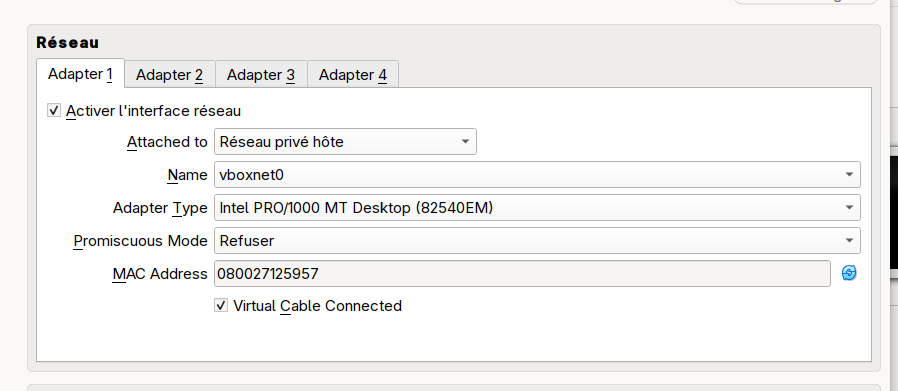
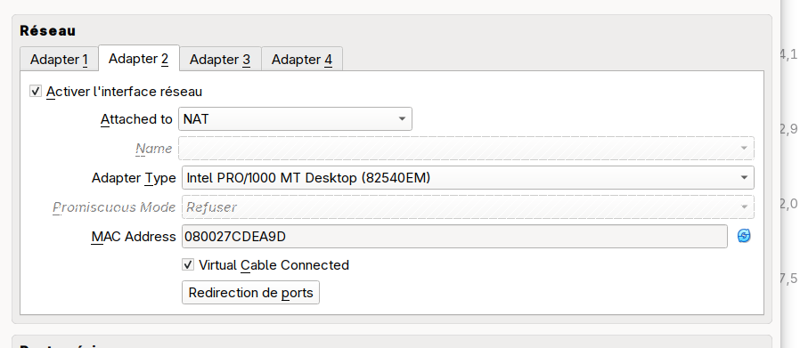

= Kubernetes scafolder

== Kubernetes

https://www.youtube.com/watch?v=-uqXhRC5uMs

Installation from VM:
[source,shell]
----
./01_kube_install.sh
----

=== Networks

The VM will have two actives networks.

WARNING: The order of networks definition is very important.

1. bridge network
+
Define a bridge network to allow host to VM communication.
+

2. nat network
+
Define a nat network to allow VM to internet communication.
+

=== Cilium

Installation from VM:
[source,shell]
----
./02_cilium_install.sh
----

Cilium is used for CNI and LoadBalancer configuration

https://docs.cilium.io/en/latest/network/node-ipam/

When running without load balancer the External IP must be bound to the host network.

Multiple prerequisites:

* Cilium installation must have the variable **nodeIPAM.enabled** set to true (https://github.com/cilium/cilium/issues/38793)
* The label **localhost.localdomain node.kubernetes.io/exclude-from-external-load-balancers** must be removed from the node
* The service must be of type **LoadBalancer**
* The service must have the **loadBalancerClass** set to **io.cilium/node**
* The order of interfaces is very important. Cilium will match only the first one found. The first one must be the one accessible via the host so the IP must begin with **192.168.**

=== Hello Sample

Installation from VM:
[source,shell]
----
./03_hello_app_install.sh
----

Host configuration using the VM **192.168...** IP from HOST
[source,shell]
----
echo "192.168.59.114 hello.local-lab.com" | sudo tee -a /etc/hosts
----

Execution from HOST
[source,shell]
----
curl http://hello.local-lab.com
----

=== Observability

https://quarkus.io/guides/observability-devservices-lgtm

1. L → Loki (logs)
+
TODO

2. G → Grafana (metrics visualization)
+
TODO

3. T → Tempo (traces)
+
TODO

4. M → Mimir (long term storage for Prometheus)
+
TODO

=== Useful commands

List all resources (except crd)
[source,shell]
----
kubectl get all -A
----

Uninstall cilium
[source,shell]
----
helm uninstall cilium -n kube-system
kubectl delete crd $(kubectl get crd | grep cilium | awk '{print $1}')
----

Get all cilium
[source,shell]
----
helm get all cilium -n kube-system
----

Get cilium installation info
[source,shell]
----
helm get values -a -o yaml cilium -n kube-system
----

Get cilium installation info regarding nodeIPAM
[source,shell]
----
helm get values -a -o yaml cilium -n kube-system | grep nodeIPAM -A 3
----

list labels on nodes
[source,shell]
----
kubectl get nodes --show-labels
----

remove label on node
[source,shell]
----
kubectl label node localhost.localdomain node.kubernetes.io/exclude-from-external-load-balancers-
----
